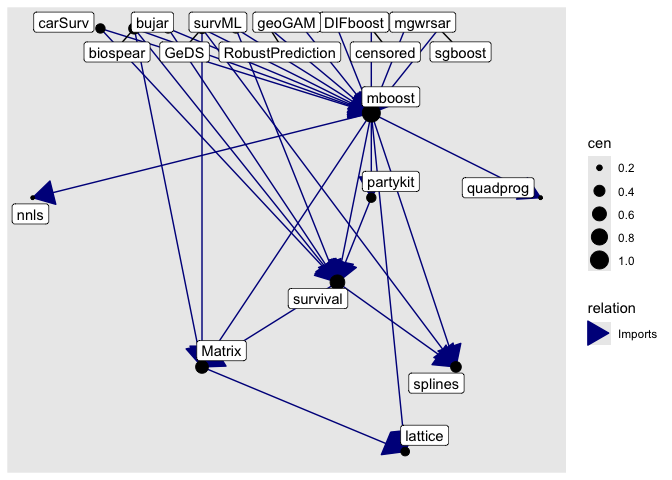

<!-- README.md is generated from README.Rmd. Please edit that file -->

# pkggraph

<!-- badges: start -->
<!-- badges: end -->

> Explore various dependencies of a package(s) (on the Comprehensive R
> Archive Network Like repositories).

## Utilities

Start with `init()` which gets metadata from a CRAN like repository.

The package offers four functions:

1.  `get_dependencies()`: Get direct or indirect dependencies of a set
    of packages at desired depth (as a dataframe).
2.  `get_neighborhood()`: Get both direct and indirect of a set of
    packages at desired depth (as a dataframe).
3.  `as_graph()`: Get metadata embedded `igraph` equivalent of a
    dependency dataframe.
4.  `plot()`: Static plot of dependency graph.

## Example

``` r
suppressPackageStartupMessages(library("dplyr"))
#> Warning: package 'dplyr' was built under R version 4.4.3
init()
#> ℹ Fetching package metadata from repositories ...
#> ℹ Computing package dependencies ...
#> ✔ Done!

# what does `mboost` package do
packmeta |> filter(Package == "mboost") |> pull(Description) |> cat()
#> Functional gradient descent algorithm
#>   (boosting) for optimizing general risk functions utilizing
#>   component-wise (penalised) least squares estimates or regression
#>   trees as base-learners for fitting generalized linear, additive
#>   and interaction models to potentially high-dimensional data.
#>   Models and algorithms are described in <doi:10.1214/07-STS242>,
#>   a hands-on tutorial is available from <doi:10.1007/s00180-012-0382-5>.
#>   The package allows user-specified loss functions and base-learners.

# Get direct 'import' dependencies of `mboost` two levels deeper
get_dependencies("mboost", level = 2, relation = "Imports")
#> # A tibble: 53 × 3
#>    pkg_1  relation pkg_2     
#>    <chr>  <fct>    <chr>     
#>  1 BayesX Imports  coda      
#>  2 BayesX Imports  colorspace
#>  3 BayesX Imports  interp    
#>  4 BayesX Imports  sf        
#>  5 BayesX Imports  sp        
#>  6 BayesX Imports  splines   
#>  7 Matrix Imports  grid      
#>  8 Matrix Imports  grid      
#>  9 Matrix Imports  lattice   
#> 10 Matrix Imports  lattice   
#> # ℹ 43 more rows

# Get neighborhood (direct and indirect) dependencies (of all types) of `mboost` one level deeper
get_neighborhood("mboost", level = 1)
#> # A tibble: 219 × 3
#>    pkg_1                     relation pkg_2   
#>    <chr>                     <fct>    <chr>   
#>  1 FDboost                   Depends  mboost  
#>  2 InvariantCausalPrediction Depends  mboost  
#>  3 TH.data                   Depends  MASS    
#>  4 TH.data                   Depends  survival
#>  5 boostrq                   Depends  mboost  
#>  6 boostrq                   Depends  parallel
#>  7 boostrq                   Depends  stabs   
#>  8 catdata                   Depends  MASS    
#>  9 censored                  Depends  survival
#> 10 expectreg                 Depends  BayesX  
#> # ℹ 209 more rows

# convert a dependency dataframe to a graph
get_neighborhood("mboost", level = 1) |> as_graph()
#> IGRAPH 148602e DN-- 55 219 -- 
#> + attr: name (v/c), title (v/c), relation (e/c)
#> + edges from 148602e (vertex names):
#>  [1] FDboost                  ->mboost      
#>  [2] InvariantCausalPrediction->mboost      
#>  [3] TH.data                  ->MASS        
#>  [4] TH.data                  ->survival    
#>  [5] boostrq                  ->mboost      
#>  [6] boostrq                  ->parallel    
#>  [7] boostrq                  ->stabs       
#>  [8] catdata                  ->MASS        
#> + ... omitted several edges

# plot a dependency graph
get_neighborhood("mboost", level = 1, relation = "Imports") |> as_graph() |> plot()
```



## Installation

From CRAN:

``` r
pak::pkg_install("pkggraph")
```

You can install the development version of pkggraph from
[GitHub](https://github.com/) with:

``` r
# install.packages("pak")
pak::pak("talegari/pkggraph")
```
